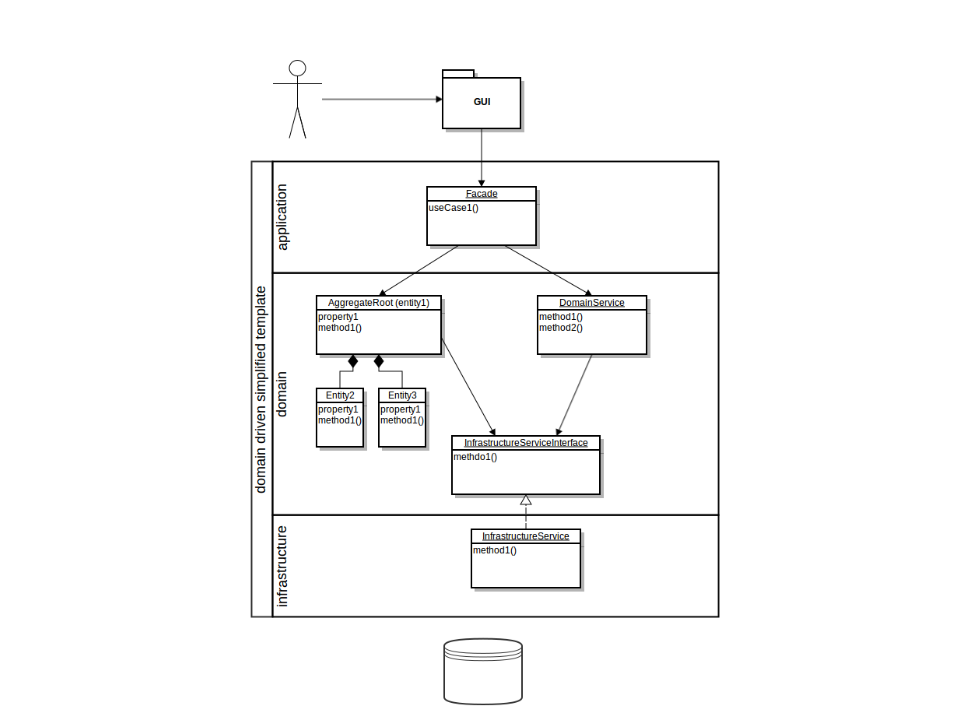
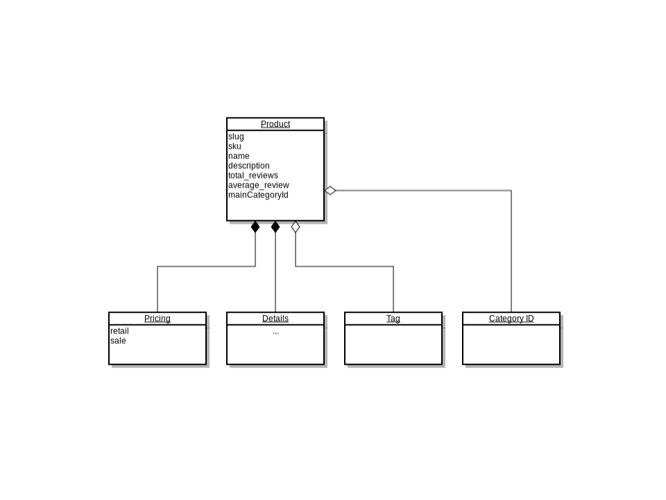
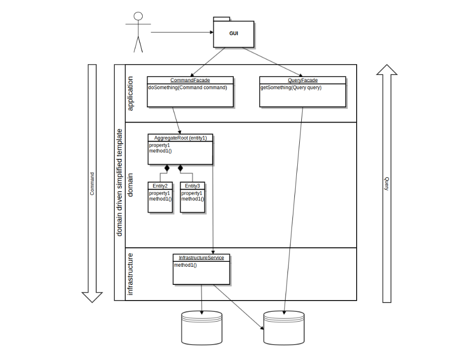

class: center, middle

# Domain Driven Design

# Building blocks

---

## Layers

UI -> Application -> Domain -> Infrastructure

If domain is mixed with other layers

- testing is awkward or hard
- business logic is cluttered
- hard to change / refactor

---

---

UI -> Application -> Domain -> Infrastructure

## Application

- coordinates activity
- does not contain business logic
- no state of business objects
- can have state of app task progress
- entry point to use cases

---

UI -> Application -> Domain -> Infrastructure

## Domain

- this is where the modelling takes place
- 1:1 ubiquitous language language
- split into smaller pieces (bounded contexts)

---

UI -> Application -> Domain -> Infrastructure

## Infrastructure Layer

- think: supporting library
- gore details of technical stuff
- persistance, I/O, etc.

---

## Building blocks

---

## Entity - has identity

--

> An object that is not defined by its attributes, but rather by a thread of continuity and its identity.
Example: Most airlines distinguish each seat uniquely on every flight. Each seat is an entity in this context. However, Southwest Airlines, EasyJet and Ryanair do not distinguish between every seat; all seats are the same. In this context, a seat is actually a value object.

---

## Value Object

--

- no identity
- exchangeable
- immutable
- throw away
- not only DTOs (have logic)

> An object that contains attributes but has no conceptual identity. They should be treated as immutable.
Example: When people exchange business cards, they generally do not distinguish between each unique card; they only are concerned about the information printed on the card. In this context, business cards are value objects.

---

## Services

--

- verbs that do not fit into any object
- stateless
- operation that refers to other objects
- think: functions, like Money Transfer

> When an operation does not conceptually belong to any object. Following the natural contours of the problem, you can implement these operations in services. See also Service (systems architecture).

--

There are different types of services

- domain services
- infrastructure services
- application services (facades)

---

## Aggregate

--

- a group of associated entities
- tree structure
- Root Aggregate encapsulates them
- root ensures invariants
- no access except for the root
- root has a global identity
- you can hold a reference to the root only
- usually eager loaded

> A collection of objects that are bound together by a root entity, otherwise known as an aggregate root. The aggregate root guarantees the consistency of changes being made within the aggregate by forbidding external objects from holding references to its members.

---

---

## Factory

--

- responsible for creating aggregates
- because aggregates are too complex to create in constructor
- because to create an entity we may need to coopeare with others

> Methods for creating domain objects should delegate to a specialized Factory object such that alternative implementations may be easily interchanged.

---

## Repositories

- all the logic to obtain an object
- can be DB, can be file, can use other service

> Methods for retrieving domain objects should delegate to a specialized Repository object such that alternative storage implementations may be easily interchanged.

---

## Bounded Context

> The setting in which a word or statement appears that determines its meaning

---

## how Bounded Contexts communicate

Different models need to be mapped

Or do they?

Options

- shared kernel + CI
- Customer - Supplier
- Conformist
- Anticorruption Layer
- Separate Ways
- Open Host Service

---

## CQRS

Command Query Responsibility Segregation

A pattern of getting the data out, without pushing it through Domain

No setters/getters on your domain objects anymore!

Works well with and without Event Sourcing.

---

---

