class: center, middle

# Medium scale building blocks

---

## Pieter Hintjens

Software developer, author of 6 books, past president of the Foundation for a Free Information Infrastructure, in 2007 nominated one of the "50 most influential people in IP", author of ["A Protocol for Dying"](http://hintjens.com/blog:115)


**Founder of ZeroMQ, high-performance asynchronous messaging library**


---


> The physics of software is not algorithms, data structures, languages and abstractions. These are just tools we make, use, throw away.

--

> The real physics of software is the physics of people—specifically, our limitations when it comes to complexity, and our desire to work together to solve large problems in pieces. 

--

> This is the science of programming: **make building blocks that people can understand and use easily**, and people will work together to solve the very largest problems.

> Pieter Hintjens, 0MQ docs, http://zguide.zeromq.org/page:all#Fixing-the-World

---

class: center, middle

## no building blocks


---

## building blocks

**large scale: ** (>few kloc)

- modules, jars

- Microservices

--

**small scale: ** (<few hundred lines)

- Private methods

- Nested classes

--

**medium scale: ** (n hundred < ?? < n kloc)

- here be dragons (for most devs)

--

- package scope composition

---

class: center, middle

### how do people use package-scope?

---

class: center, middle

### java.util

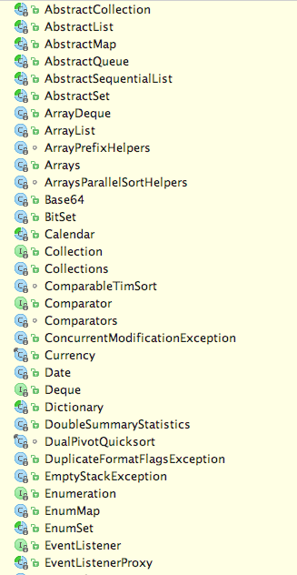 

---

class: center, middle

### com.google.common.collect

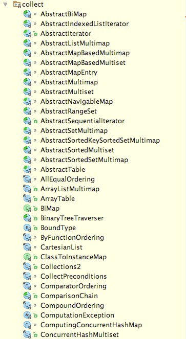

---

## Is Java package level scope useful?

> If you are working on an application and don't have need to worry about other users, package level protection isn't something you need to worry about. 

> **Other than various aspects of design purity, you could make everything public and be ok with that.**

> user40980 @ stackexchange [http://programmers.stackexchange.com/questions/294640/is-java-package-level-scope-useful]

---

class: center, middle

### Petclinic 2016

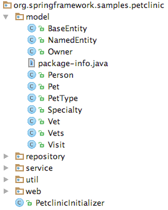

If you divide your packages into layers, everything HAS to be public

---

class: center, middle

## why? fashion?


---

class: center, middle

### Greenhouse 2012

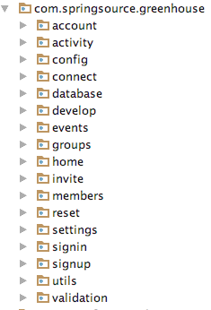

When you divide vertically (or semi-vertically, as here), you can do as you wish

---

class: center, middle

### Greenhouse 2012

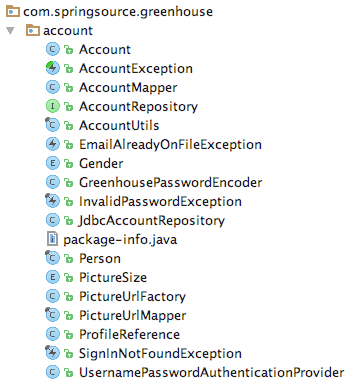

Alas, this knowledge seems to be lost

---

## other langs

Kotlin - no package whatsoever

- public (default, no special keyword)
- private
- protected
- internal (maven/gradle/ant project; good for libs)

--

Groovy - an afterthought (since 1.8)

- public (default, no special keyword neeed)
- private
- protected
- @PackageScope //reverts back to Java behavior for default

--

Scala - much more powerful (as always)

- public (default, no special keyword)
- protected (also restricted to package/etc of your choice)
- private (also restricted to package/etc of your choice)

---

> **Other than various aspects of design purity, you could make everything public and be ok with that.**

> [user40980 @ stackexchange]

--


> Package scope is really easier to maintain

> [me, right now]

---

class: center, middle

### What if package-scope was the default

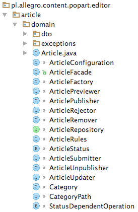

Advantages?

---

## Advantages

One public class makes it clear, where the entry point is

Less to put into your head (more to safely ignore)

Easier to test (you can focus only on public class if you want)

Easier to refactor, move, move out, or throw away

Simple blocks, with simple APIs

--

Gues what?! It is the default in Java (WINK, WINK)


---

### Published?

> [Schwern: http://stackoverflow.com/questions/215497/in-java-difference-between-default-public-protected-and-private]

> (Caveat: I am not a Java programmer, I am a Perl programmer. Perl has no formal protections which is perhaps why I understand the problem so well :) )

--

> Private [...] Package Private [...] Protected [...] Public [...]  

--

> **Published [...] Visible outside the code I control. (While not Java syntax, it is important for this discussion) [...]**

--

> Personally, **I stick with just "private" and "public"**. Many OO languages just have that. "Protected" can be handy, but it's really a cheat. Once an interface is more than private it's outside of your control and you have to go looking in other people's code to find uses.

--

> This is where the **idea of "published"** comes in. [...] You must support that interface or risk breaking code.

---

class: center, middle


### **public MEANS published**

---

## Let's write some articles.

Stuff client asked for
- CreateArticleAcceptanceSpec
- DeleteArticleAcceptanceSpec
- PreviewArticleAcceptanceSpec
- PublishArticleSuccessAcceptanceSpec
- RejectArticleAcceptanceSpec
- UnpublishArticleAcceptanceSpec
- UpdateArticleAcceptanceSpec

Stuff UX asked for (client took for granted)
- FetchArticleListByAuthorAcceptanceSpec
- FetchArticleListByTitleAcceptanceSpec
- SearchArticleByAuthorAcceptanceSpec
- SearchArticleByBioAcceptanceSpec
- SearchArticleByIdAcceptanceSpec
- SearchArticleByStatusAcceptanceSpec
- SearchArticleByTitleAcceptanceSpec
- SearchArticleByTitleAndQueryAcceptanceSpec

---

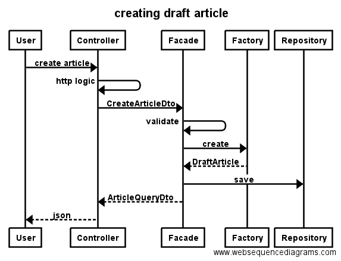

---

**Which classes have to be public** (to create draft article)?
- Controller
- Repository
- Factory
- Article
- Configuration (@Configuration with @Beans)
- Facade

--

None

--

**Which should be public?**

--

API for your domain (bounded context or aggregate root), that other can use
- Facade

Public data structures (nested in Facade for now)
- CreateArticleDto
- ArticleQueryDto

--

Controllers do not have to know anything except for Facade & DTOs, so we can move them out.

---

```
article/
├── ArticleActionsEndpoint.java
├── ArticleContentValidationEndpoint.java
├── ArticleCrudEndpoint.java
├── UpdateArticleDtoVersusPathParameterValidator.java
├── domain
│   ├── Article.java
│   ├── ArticleConfiguration.java
│   ├+─ ArticleFacade.java
│   ├── ArticleFactory.java
│   ├── ArticlePreviewer.java
│   ├── ArticlePublisher.java
│   ├── ArticleRejector.java
│   ├── ArticleRemover.java
│   ├── ArticleRepository.java
│   ├── ArticleRules.java
│   ├── ArticleStatus.java
│   ├── ArticleSubmitter.java
│   ├── ArticleUnpublisher.java
│   ├── ArticleUpdater.java
│   ├── Category.java
│   ├── CategoryPath.java
│   ├── StatusDependentOperation.java
│   ├── dto/...
│   └── exceptions/...
```

---

## How about query/search?

For the GUI
- FetchArticleListByAuthorAcceptanceSpec
- FetchArticleListByTitleAcceptanceSpec
- SearchArticleByAuthorAcceptanceSpec
- SearchArticleByBioAcceptanceSpec
- SearchArticleByIdAcceptanceSpec
- SearchArticleByStatusAcceptanceSpec
- SearchArticleByTitleAcceptanceSpec
- SearchArticleByTitleAndQueryAcceptanceSpec

For other packages that need some article info?

---

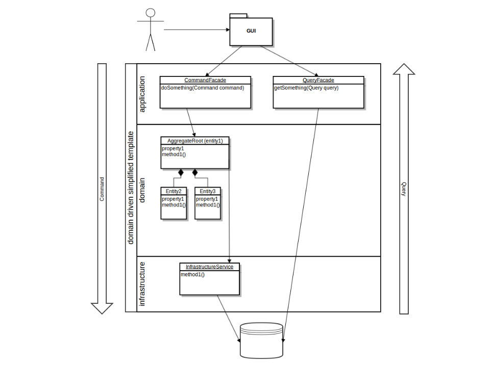

---

```Java
@Document(collection = MongoCollections.ARTICLES)
@TypeName("articles")
class Article implements DraftArticle, SubmittedArticle, DeletedArticle, RejectedArticle, PublishedArticle {...}
```

--

```Java
@Getter
@Builder
@Document(collection = MongoCollections.ARTICLES)
@ToString(exclude = "content")
@AllArgsConstructor
public class ArticleQueryDto {
	//Mapping only data I want to share
}
```

--

```
article/
├── ArticleQueryEndpoint.java
└── query
    ├+─ ArticleQueryDto.java
    ├+─ ArticleQueryRepository.java
    └+─ ArticleSearchParams.java
```

---

class: center, middle

## next package

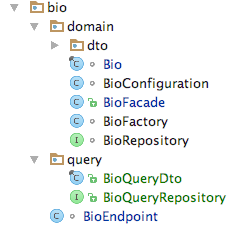

---


## infrastructure

```Java
public interface CategoryTreeClient ....
```

--

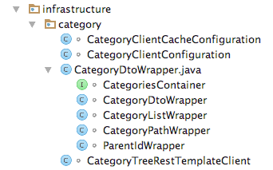

--

```Java
@Configuration
class CategoryClientConfiguration {
    @Bean
    CategoryTreeClient categoryTreeClient(...) {
	    ...
        return new CategoryTreeRestTemplateClient(...);
    }
}
```

Not a single public class was given

---

### @Autowired / @Component makes it public

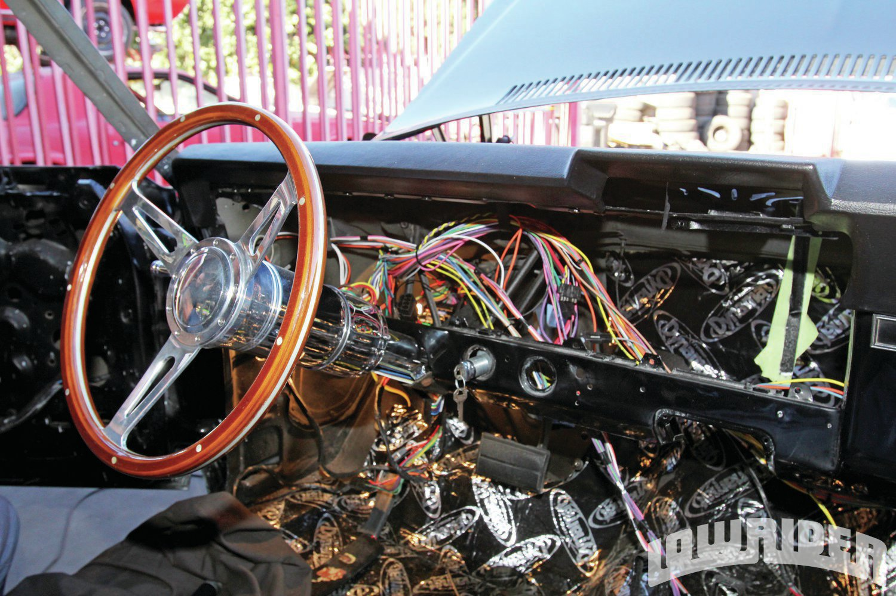

---

## @Configuration

Only one bean for you bro.

```Java
@Configuration
class ArticleConfiguration {

    @Bean
    ArticleFacade articleFacade(ArticleRepository articleRepository, ReaderClient readerClient, ArticleFactory factory, FrontendProperties frontendProperties) {
        ArticleUpdater updater = new ArticleUpdater(articleRepository);
        ArticleSubmitter submitter = new ArticleSubmitter(articleRepository);
        ArticleRemover remover = new ArticleRemover(articleRepository);
        ArticleRejector rejector = new ArticleRejector(articleRepository);
        ArticleUnpublisher unpublisher = new ArticleUnpublisher(articleRepository, readerClient);
        ArticlePublisher publisher = new ArticlePublisher(articleRepository, readerClient);
        ArticlePreviewer previewer = new ArticlePreviewer(readerClient, frontendProperties, articleRepository);
        return new ArticleFacade(updater, submitter, remover, rejector, unpublisher, publisher, factory, previewer, articleRepository);
    }
```

--

Why would any of this be public?

--

Also, can I haz some infrastructure plz? (explicit content!)

--

Call this method to get **fully configured DOMAIN** (for your unit tests for example), working on whatever infrastructure you like

---

## Hexagonal architecture 

a.k.a. "Ports & Adapters"

> Allow an application to equally be driven by users, programs, automated test or batch scripts, and to be developed and tested in isolation from its eventual run-time devices and databases.

> [http://alistair.cockburn.us/Hexagonal+architecture]


---

## Testing package scope

But what if we want to reach package-scope code in an acceptance test?

--

R U Sure? 

--

```Groovy
package pl.allegro.content.popart.editor.article.search //anything you want

class SearchArticleByAuthorAcceptanceSpec extends MvcIntegrationSpec
        implements OperatingOnArticleEndpoint, OperatingOnArticleRepository {

	@Before
    void prepareArticlesForSearch() {
        articles = [author1WithPrefix, author2WithPrefix, author3].collect {
            saveArticle([title: it])
        }
    }
```

--

```Groovy
package pl.allegro.content.popart.editor.article.domain //same as repo

@SelfType(MvcIntegrationSpec)
@CompileStatic
trait OperatingOnArticleRepository {
    ArticleQueryDto saveArticle(Map properties = [:]) {...}
```

---

Why do I care about test packages?

--

Because I do BDD, my acceptance tests and their packaging comes from requirements, not from implementation alone

--

Acceptance specs

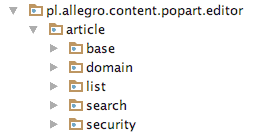

--

Production code

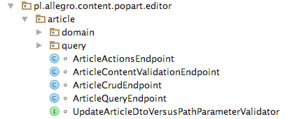

--

Guava @VisibleForTesting not needed


---

## inheritance violates encapsulation

--

> problems discussed in this item do not apply to interface inheritance 

> [Joshua Bloch - Effective Java, page 81]

--

--- 

> Bill Venners: When asked what you might do differently if you could recreate Java, you've said you've wondered what it would be like to have a language that just does delegation.

> James Gosling: Yes.

> [...]

> Bill Venners: But by delegation, you do mean this object delegating to that object without it being a subclass?

> James Gosling: Yes -- without an inheritance hierarchy. Rather than subclassing, just use pure interfaces. It's not so much that class inheritance is particularly bad. It just has problems.

> [http://www.artima.com/intv/gosling34.html]

---

## Inheritance anti-patterns

--

**incoming and outgoing invoice**

--

Do not inherit, when data is the same, but use cases are different

--

**Square extending Rectangle problem**

--

> A typical example that violates LSP is a Square class that derives from a Rectangle class, assuming getter and setter methods exist for both width and height. The Square class always assumes that the width is equal with the height. If a Square object is used in a context where a Rectangle is expected, unexpected behavior may occur because the dimensions of a Square cannot (or rather should not) be modified independently. 

> [https://en.wikipedia.org/wiki/Liskov_substitution_principle]

--

Do not inherit, because you see an is-a relation

--

What if use cases are the same, data is the same, and behaviour is different?

---


```Java
//I want this object to be serialized to json, I want the data
abstract class OfferBox extends LocationAwareBox implements MergeableBox {
    private String searchPhrase;
    private Price priceFrom;
    private Price priceTo;
    private List<Long> sellerIds;
    private String categoryId;
    private Integer limit;
    ...
    //shared behaviour
    protected <T extends OfferBox> MergeableBox merge(Box otherBox, 
    	Class mergableClass, Function<OfferMultiBox<T>, Frame> frameBuilder) {...}
```

--

```Java
class OfferCarouselBox extends OfferBox { //one of implementations
    @Override
    public Frame toFrame() {
        return Frame.builder()
                .offerCarouselBox(this)
                .startingLineNumber(startingLineNumber)
                .build();
    }

    @Override
    public MergeableBox merge(Box otherBox) {
        return merge(otherBox, OfferCarouselBox.class, this::getMultiBoxFrameBuilder);
    }

    private Frame getMultiBoxFrameBuilder(OfferMultiBox<OfferCarouselBox> offerTilesBoxOfferMultiBox)...
}
```

---

```Java
class OfferBox implements MergeableBox {
    private String searchPhrase;
    private Price priceFrom;
    private Price priceTo;
    private List<Long> sellerIds;
    private String categoryId;
    private Integer limit;

    @JsonIgnore
    private WhichMethodToFillInFromBuilder<OfferBox> offerBoxToFrame;

    @JsonIgnore
    private WhichMethodToFillInFromBuilder<OfferMultiBox> multiOfferBoxToFrame;

    @Override
    public Frame toFrame() {
        return offerBoxToFrame.toFrame(this, startingLineNumber);
    }

    @Override
    public MergeableBox merge(Box otherBox) {
        OfferMultiBox multiBox = 
	        new OfferMultiBox( startingLineNumber, 
	        				   multiOfferBoxToFrame, 
	        				   markdownDefinition);
        multiBox.merge(this);
        multiBox.merge(otherBox);
        return multiBox;
    }

```

---

```Java
public class OfferBoxBuilder implements BoxBuilder {
    public static OfferBoxBuilder offerTiles() {
        return new OfferBoxBuilder("[box:offerTiles]",
                (frameBuilder, offerBox) -> 
                	frameBuilder.offerTilesBox(offerBox),
                (frameBuilder, multiOfferBox) ->
                	frameBuilder.offerTilesMultiBox(multiOfferBox));
    }

    public static OfferBoxBuilder offerCarousel() {
        return new OfferBoxBuilder("[box:offerCarousel]",
                (frameBuilder, offerBox) -> 
                	frameBuilder.offerCarouselBox(offerBox),
                (frameBuilder, multiOfferBox) ->
                	frameBuilder.offerCarouselMultiBox(multiOfferBox));
    }
	...
}

OfferBox tilesBox = OfferBoxBuilder.offerTiles()
OfferBox carouselBox = OfferBoxBuilder.offerCarousel()

```

--

> Avoid allowing the client code to directly select an implementation class of an interface. 

> Favor Composition With Functional Interfaces and Lambdas Over Inheritence

> [https://dzone.com/articles/the-java-8-api-design-principles]


---

## Summary

The default visibility of package scope in Java makes great sense

...if you take it seriously, and use it to design your packages, it brings loose coupling and high cohesion

...if you let it drive your architecture

...then it also brings the benefit of Hexagonal Architecture / Ports & Adapters (unit testing 4 real)

It's actually simpler than not doing it (same with CQRS)

**Make building blocks that people can understand and use easily**
