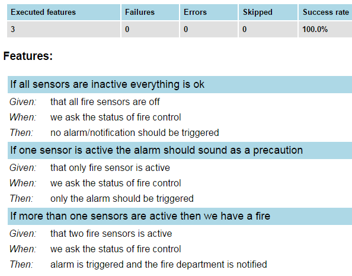

class: center, middle

# Designing test cases

by Jakub Nabrdalik

---

# Documenting requirements

> If the discipline of requirements specification has taught us anything, it is that well-specified requirements are as formal as code and can act as executable tests of that code!

> [Robert C. Martin, Clean Code: A Handbook of Agile Software Craftsmanship]

--

How do you document requirements?

--

### Use cases

> In software and systems engineering, a use case is a list of actions or event steps, typically defining the interactions between a role (known in the Unified Modeling Language as an actor) and a system, to achieve a goal

---

## Use cases

Alistair Cockburn - Writing Effective Use Cases

- Title: "an active-verb goal phrase that names the goal of the primary actor"
- Primary Actor
- Goal in Context
- Scope
- Level
- Stakeholders and Interests
- Precondition
- Minimal Guarantees
- Success Guarantees
- Trigger
- Main Success Scenario
- Extensions
- Technology & Data Variations List

---

## Use cases simplified

By both Alistair Cockburn, and Martin Fowler

- Title: "goal the use case is trying to satisfy"
- Main Success Scenario: numbered list of steps
- Step: "a simple statement of the interaction between the actor and a system"...
- Extensions: separately numbered lists, one per Extension
-- Extension: "a condition that results in different interactions from .. the main success scenario". An extension from main step 3 is numbered 3a, etc

---

## User stories

User stories were invented in eXtreme Programming (XP)

> a description consisting of one or more sentences in the everyday or business language of the end user or user of a system that captures what a user does or needs to do as part of his or her job function

--

Format

> "In order to (receive benefit) as a (role), I want (goal/desire)"

Example

> As a user, I can indicate folders not to backup so that my backup drive isn't filled up with things I don't need saved.

--

The simplicity of a user story also causes another limitation. It usually has no performance or non-functional requirement details.

---

## Behavioural specifications

BDD specifies that business **analysts and developers should collaborate** in this area and should specify behavior in terms of user stories, which are each explicitly written down in a dedicated document. 

Each user story should, in some way, follow the following structure

- Title: The story should have a clear, explicit title. 
- Narrative: A short, introductory section that specifies **who** (which business or project role) is the driver or primary stakeholder of the story (the actor who derives business benefit from the story)
- what **effect** the stakeholder wants the story to have
- what **business value** the stakeholder will derive from this effect

---

## BDD Acceptance scenarios

A description of each specific case of the narrative. Such a scenario has the following structure:

- It starts by specifying the **initial condition** that is assumed to be true at the beginning of the scenario. This may consist of a single or more clauses
- It then states which **event** triggers the start of the scenario.
- Finally, it states the **expected outcome**, in one or more clauses

Also known as: Given/When/Then

---

## BDD example

Story: Returns go to stock

- In order to keep track of stock
- As a store owner
- I want to add items back to stock when they're returned.

Scenario 1: Refunded items should be returned to stock

- Given that a customer previously bought a black sweater from me
- And I have three black sweaters in stock.
- When he returns the black sweater for a refund
- Then I should have four black sweaters in stock.

Scenario 2: Replaced items should be returned to stock

- Given that a customer previously bought a blue garment from me
 -And I have two blue garments in stock
- And three black garments in stock.
- When he returns the blue garment for a replacement in black
- Then I should have three blue garments in stock
- And two black garments in stock.

---

## Point on examples

While use cases were quite often written a bit abstract, BDD scenarios are by nature EXACT examples. Why?

--

It turns out, it's much easier to talk about specific examples

--

Some business people are not as good at abstract thinking as enginners, you can get them lost in abstraction

--

Very specific examples (numbers, names, etc.) make it easier for them to focus on how things should work in real life

--

But beware, you have to explore. Do not asume business thinking is disciplined

> "Is this a rule? Does it happen all the time?"

--

> "Yes, absolutely, all the time! 

--

> "...Except maybe when..."

---

## runnable specifications

If we can run specifications as tests, we know the system works as intended

--

Two types of tools:
- specs are plain text
- specs are together with code

---

## specs are plain text

tools run them with code written somewhere else

```JBehave
Scenario: Eric wants to withdraw money from his bank account at an ATM
    Given Eric has a valid Credit or Debit card
    And his account balance is $100
    When he inserts his card
    And withdraws $45
    Then the ATM should return $45
    And his account balance is $55
```

---

## specs are together with code

```Groovy
def "customer can rent films"() {
    given: "there is a film in catalogue"
        Film film = persistedFilms[0]

    when: "renting a film"
        ResultActions resultActions = rentAFilm(film)

    then: "we get the rent Id"
        resultActions.
                andExpect(status().isOk()).
                andExpect(jsonPath('rentId').value(any(Integer)));

    when: "we search for the rent"
        long rentId = getRentId(resultActions)
        resultActions = mockMvc.perform(get("/rents/$rentId"))

    then: "it's the rent for the film we wanted"
        rentHasReturnedOn(resultActions, film, nullValue())
}
```

---

## what is better?

---

## specs as plain text

Advantages

--

- business can write them
- business can modify them
- business can do exploratory testing

--

Disadvantages

--

- writing in-the-middle part (glue code) is slow
- in-the-middle part can have its own bugs

--

In reality business rarely works on scenarios. They prefer engineers to do it

--

And it's ok, because business people quite often have self-contradicting requirements, are not rigid enough, and basically need an engineer's mind to work with

--

We are trained in logic, because compilers require that. Business people amy be not. Some use their intuition more than analysis

---

## specs together with code

Advantages

--

- faster/easier writing and maintenance
- test outcomes are just as readable as plain text

---



---

## specs together with code

Disadvantages

--

- business cannot write/modify them


---

## exercise

Write down what tests and of what type should we have for this story. 

Only one example scenario is given. Work out the rest.

> Story: Returns go to stock
> 
> - In order to keep track of stock
> - As a store owner
> - I want to add items back to stock when they're returned.
> 
> Scenario 1: Refunded items should be returned to stock
> 
> - Given that a customer previously bought a black sweater from me
> - And I have three black sweaters in stock.
> - When he returns the black sweater for a refund
> - Then I should have four black sweaters in stock.

---

## happy path

Acceptance tests (UI or not) are very slow. We should have only the happy path tested

Integration tests are slow. We should only have what requires integration

Unit tests are fast. We should test all corner cases here

---

## corner cases

Apart from the execution time, why is it helpful to have corner cases in unit tests?

--

How do we setup ("given part") for a corner case?

--

It's much easier to setup a unit, then a full stack application

--

It's also much easier to change, and explore a unit test, than a full stack application

---

## what is hard to test automatically

--

- User eXperience
- User interface design
- Concurrency (deadlocks etc.)

--

Because of the first two, and because we cannot think beforehand on all corner cases, manual testing is still needed.

--

Who should do the manual testing then? The developer who wrote it? A separate QA? Your client?

--

All three. For different reasons

- Developer feels more responsible for his work
- QA doesn't follow the path that author did
- Client can give feedback that noone else can

--

How about testing concurrency?

--

We can change the architecture to something that is easy to test instead (formal guarantees: if it works single-threaded, it will work multi-threaded).

Actors, Agents, Optimistic locking, Fork-Join, Dataflow...

---

## when we should not test automatically

--

When prototyping

--

What are prototypes for?

--

Prototypes are for us to learn

--

All prototypes should be deleted afterwards

--

Prototypes should never go to production

--

Instead, they often do. And we have madness

--

Story - Witcher 2 AI

---

## bad/good design practices

Exercise: 

Your client wants "something like twitter". Your company is supposed to shape the product, so there are no rigid requirements. You have to come up with your own design. And you own tests.

Task - describe how you will test the application, what kind of tests you will have, and write down those test scenarios (assume you use something like jbehave, no code at this point)

---

## bad/good design practices

Typical problems

- too many acceptance/integration tests, where unit test would be enough
- no unit tests at all
- not enough scenarios (because setup is hard, because we write acceptance tests)
- requirements not written down
- business never seeing acceptance test reports
- not using parametrized tests
- not using the ubiquitous language for the tests
- not using tests for communication
- forgetting what the goals of testing are

---

### [part 3: anatomy of a test](part3.html)