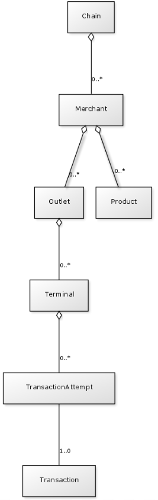
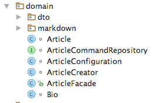

class: center, middle

# setup & cleanup

by Jakub Nabrdalik

---

## Test Setup

a.k.a.: test fixture

This is where we prepare the test environment (or the system under test), but it doesn't have to be an explicit part of our test assumptions

```Groovy
def setup() {...}         // run before every feature method
def setupSpec() {...}     // run before the first feature method
```

--

Remember, think twice about what is an explicit assumption for the test, and what is implicit.

--

Example:

```Groovy
def setup() {
    userRepository.save(user)
    loggedUserRepository.login(user)
}

//You can also use JUnit annotations
@Before
void signUserIn() {
    userRepository.save(user)
    loggedUserRepository.login(user)
}
```

---

What is better?

```Groovy
def setup() {
    userRepository.save(user)
    loggedUserRepository.login(user)
}
```

```Groovy
@Before
void signUserIn() {
    userRepository.save(user)
    loggedUserRepository.login(user)
}
```

--

JUnit annotations allow you to give meaningful names, and separate fixture into several small methods.

If you use setup, use extract method to separate fixtures into small methods.

```Groovy
def setup() {
  signUserIn()
}

private void signUserIn() {
    userRepository.save(user)
    loggedUserRepository.login(user)
}

```

---

## building objects and state



While setting up data for integration/acceptance/unit tests, it is tempting to just go with calling a constructor, or doing an insert into the database with object being in the desired state.

--

```Groovy
given:
  Chain chain = new Chain(corporateName: 'someName',
   tradingName: 'tradingName')

  Merchant merchant = new Merchant(name: 'merchant')
  chain.addToMerchants(merchant)
  Outlet outlet = new Outlet(name: 'outlet')
  merchant.addToOutlets(outlet)
  Terminal = ...
```

--

This, however, is a very poor decision.

--

What happens after a while, is that the database schema and/or the object invariant change, and our object in test is created in an incorrect way. That may not be obvious from the beginning (tests still pass), but it shows in corner cases, where you have to fight with a state of the object, that is not legal/possible in runtime on production.

---

There is a solution for that.



First, we separate the domain DDD style, into a package that holds no dependency to any infrastructure (database, etc.), and thus can be tested completely via unit tests. 

--

Second, whenever we want to create a domain object, we use the same methods available in the domain (either via public facade, or calling rich domain methods), so that our setting up of domain objects is using exactly the same code we use on production.

--

We may create a nice adapter, for the test code, so that we give parameters in a readable way, but it still would call the original production method

--

So in the situation shown in the image, we would either call an ArticleFacade (the only public class), or at least the ArticleCreator, to create an Article

---


Let's go back to our original example of a TransactionAttempt

In Production code we have

```Groovy
class TransactionAttemptBuilder {
  TransactionAttempt build(PaymentCommand command) {...}
}
```

--

In test code we have an adapter with a delegate

```Groovy
class TransactionAttemptBuilderTestAdapter {
  TransactionAttempt buildByAmount(
    String terminalShortCode,
    BigDecimal amount, String customerMsisdn,
    Channel channel, productId, 
    String externalCustomerId) {
  ...
  }
}

```

This way whenever our invariants change, our tests will also get automatically refactored.

--

If you do not have your domain separated from infrastructure, you will most likely only be able to do it in integration/acceptance tests, and it will be slow. Very slow.

---


## getting domain to desired state

The same applies, if we want to get our domain objects to desired state.

--

We could just create an Article with state published, by calling new Article(), but it would not be maintanable.

--

Our changes in state may change our invariants in the future.

--

The only way to be future-proof, is to create a new Article, and walk it through to desired state, as in production.

---

In test we want to use it like this

```Groovy
        given:
            Article article = articleWithStatus(ArticleStatus.PUBLISHED);
```

Assuming we want to walk the Article through its API, not the bounded context facade (which is another option), we create our helper method, that walk through states untill it reaches our destination

---

```Groovy
static Article articleWithStatus(ArticleStatus status) {
      Article article = createNewArticle(TITLE_VALUE)
      return walkToDesiredState(status, article)
  }

  private static class ArticleStateWalkThrough {
      private ArticleStatus desiredStatus;
      private Article article;

      static Article walkToDesiredState(ArticleStatus desiredStatus, Article article) {
          ArticleStateWalkThrough walkThrough = new ArticleStateWalkThrough(desiredStatus, article)
          return walkThrough.walkToDesiredState()
      }

      private ArticleStateWalkThrough(ArticleStatus desiredStatus, Article article) {
          this.desiredStatus = desiredStatus
          this.article = article
      }

      ...
```

---

```Groovy
      Article walkToDesiredState() {  //HERE WE DO THE WALK (Elvis Operator)
          return step { article.submit() } ?:
                 step { article.reject() } ?:
                 step { article.submit(); article.delete() } ?:
                 step { article.restore(); article.submit() } ?:
                 step { article.publish() } ?:
                 article
      }

      private Article step(Closure<Article> closure) {
          if(article.status == this.desiredStatus) return article;
          closure.call()
          return null
      }
  }
```

---

## database in tests

There are several ways to work with database in tests

The most common ones are

- database in memory
- dedicated "immutable" database
- copy of production database

---

## copy of production database

--

This is usually a very bad idea. Don't do this, unless you are in a situatuon where you have no existing tests, and you have to start writing tests from the scratch. But even then, don't do it.

If you need to reproduce a bug in production, logs should provide you with enough information to do it. You can investigate production database, but do not copy it.

In many companies you will not be able to even do that, due to legal and security concerns.

---

## dedicated "immutable" db

--

A separate instance of the db, used solely for automated tests.


--

Works very well with RDBMSes, because each test can run in a transaction, and roll back a the end, therefore tests can be run in parallel, and do not influence each other.

Do not use it with DBs that have no transaction isolation, or systems that make commits internally and cannot run nested transactions (pretty much all NoSQL solutions).

---

## dedicated "immutable" db

Advantages

--

- very fast tests on local network (DB is already running)
- easy to set up (same as prod DB)
- DB can be prepopulated with data (have typical domain objects already present), thus speeding test runs even more

--

Disadvantages

- you have to be in local network
- if you want to move codebase back in time, your schema can be no longer valid
- in some companies, it takes a long time to get a DB when you need it
- if your project goes into deep maintanance mode, and you come back to it in a few years, your test db will probably be gone

--

Advice - always create the DB from your code (use liquidbase or similar)

---

## database in memory

A db instance, that starts on local machine (in memory usually) during the test run.

Doesn't have to be identical to production DB, but should be very similar. For example H2 (http://www.h2database.com/) and HSQL (http://hsqldb.org/) support non standard SQL syntax from other databases (like Oracle) so that you can run your native SQL on in-memory DB.

--

Advantages

- easy to control
- easy to maintain: codebase is always 1:1 with db
- you can run tests everywhere, no additional requirements apart from JVM

--

Disadvantages

- due to DB starting, it is slower than "immutable" db
- because the DB is empty at the beginning, if each tests inserts similar required data, your tests can get very slow

---

## database in memory

Advice - prepopulate the DB with typical data in a test bootstrap (run once for all tests) to speed it up

In DBs that have no transaction isolation, remember to always use unique ids per test, and always delete data after each test. In other words, always assume all your tests run in parallel

--

By the way, what are the options to run tests in parallel?

---

## test cleanup

This is where we cleanup after test, so that each execution leaves the world the same it was before.

```Groovy
def cleanup() {}       // run after every feature method
def cleanupSpec() {}   // run after the last feature method
```

--

If you use transactional databases, this is where you call rollback. In Spring and many other frameworks, the test support will do that for you atuomatically.

--

In non-transactional databases, this is where you have to manually delete all the data you've inserted.

Do not share data in db between tests.

--

Still, remember about your tests being run in parallel. Cleaning up data is not enough. Be prepared for other tests running while your runs.

--

In Spock, you can also use JUnit annotations: @After and @AfterClass

---

## what not to clean up

In case you use a IoC container like Spring, you may want to make changes to the state of the application (beans registered in Spring). 

Spring has a @DirtiesContext annotation to help you with such tests, and there are projects like springockito that help you further

--

Don't do it! This is a very bad idea, because it requires Spring to either recreate the context (which is slow) and messes with other tests run in parallel (beans are a shared state)

--

In my 11 years of building software with Spring, I had 0 cases where it was needed

--

All the cases I've seen, when someone used it, it was due to poor design choices or lack of knowledge

The same applies to @Primary in Spring tests. We will deal with it later in Integration testing

---

## fixture method execution order

When tests inherit from each other (there is a base class for tests) the setup/cleanup order behaves the only logical way

--

- setupSpec / @BeforeClass of a parent
- setupSpec / @BeforeClass of a child
- setup / @Before of a parent
- setup / @Before of a child
- child test method (specification)
- cleanup / @After of a child
- cleanup / @After of a parent
- cleanupSpec / @AfterClass of a child
- cleanupSpec / @AfterClass of a parent

---

### [part 5: testing in isolation](part5.html)
