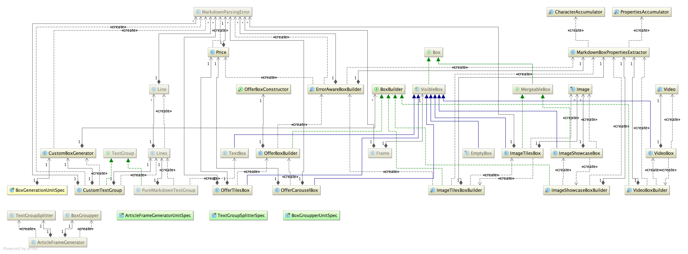
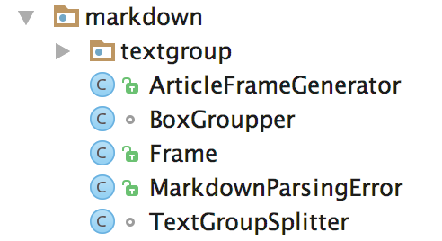
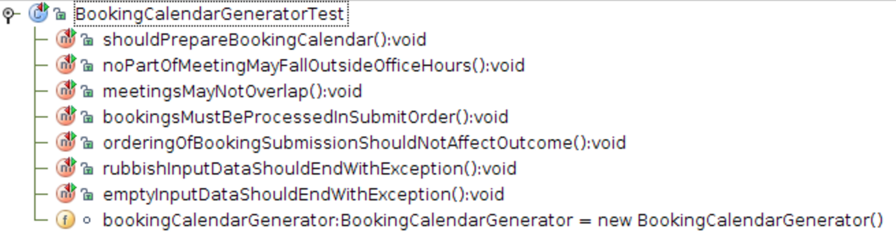
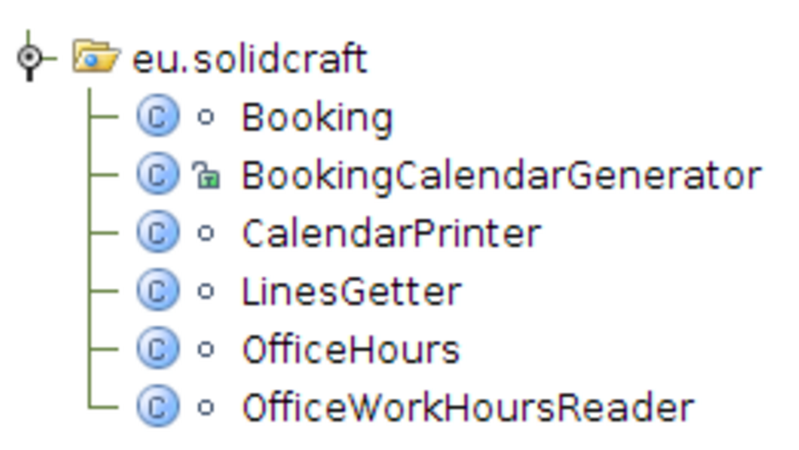
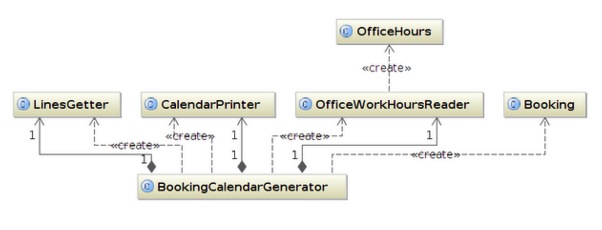
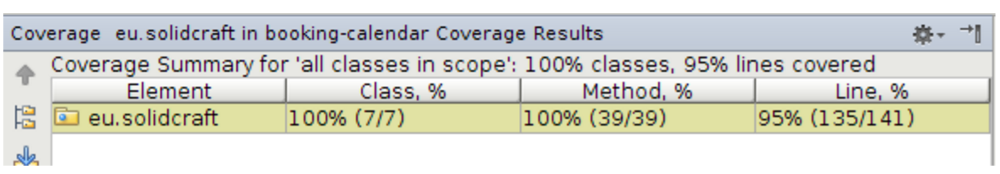
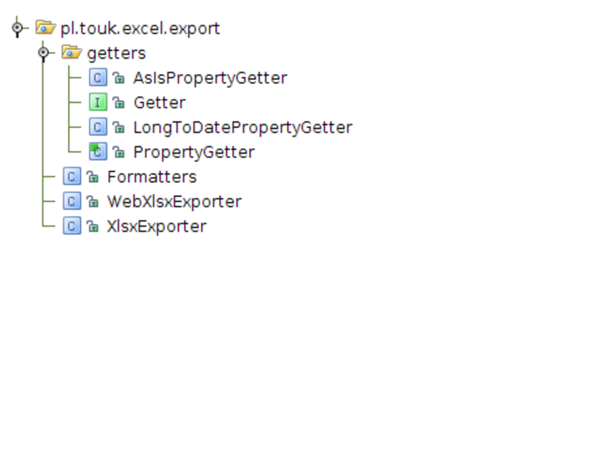
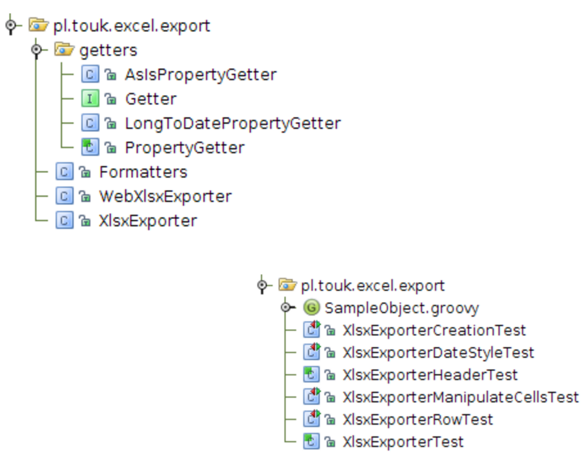
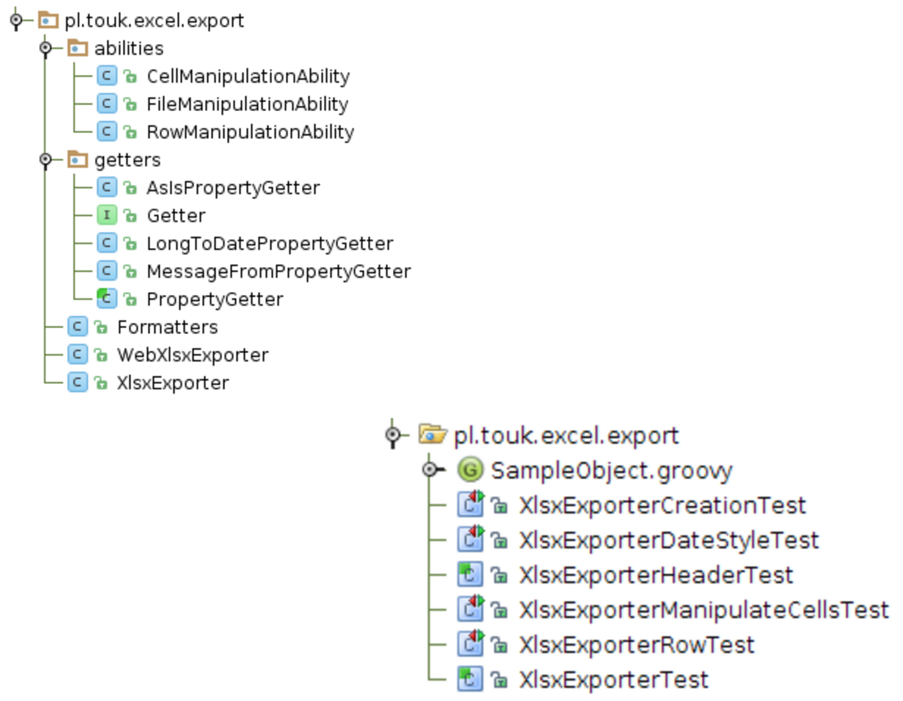

class: center, middle

# Organizing tests

by Jakub Nabrdalik

---

> What this team did not realize was that having dirty tests is equivalent to, if not worse than, having no tests. 

> Test code is just as important as production code. It is not a second-class citizen. It requires thought, design, and care. It must be kept as clean as production code.

> Robert C. Martin, Clean Code: A Handbook of Agile Software Craftsmanship

---

## Organizing tests

What test classes should you have in your project? 

--

Typical choices

- test per class
- test per feature
- test per unit

--

The most common is test per class. Do not get fixed on this schema.

---

## Unit example

Consider this

We have a domain object Article, that has such domain methods

```
restore
delete
submit
reject
publish
republish
```

How many test unit classes should this object have?

---

Each method contains business logic, and we come up with several corner cases. This means that we would have >30 test methods in a single unit test class, which is hardly maintenable. 

--

Also, each domain method has its own setup (we need an Article in a specific state and specific data).

--

Thus, if try to split those tests by the domain logic, and shared setup, we end up with this 

```
package domain:

ArticleDeleteUnitSpec
ArticlePublishUnitSpec
ArticleRejectUnitSpec
ArticleRestoreUnitSpec
ArticleSubmitUnitSpec
ArticleUpdateUnitSpec
SampleArticle
```

---

Now let's say we have an Acceptance test for publishing article: full http test, that integrates everything, and answers the question how the app works as a black box

- We do not test a single class, we test the system
- We have some successful and some faililng test scenarios
- We can organize them anyway we wish

How many testing classes should we have?

--

Soon we find out that all successful scenarios have very similar setup, while all failing scenarios have nothing in common. So we decide to split it into two files


```
PublishArticleFailureAcceptanceSpec
PublishArticleSuccessAcceptanceSpec
```

--

If we had too many failing scenarios to manage, we would split that one even further

---

Imagine we have a package markdown, where there are a bunch of classes (real world example)



--

In case you cannot see it, let's print a tree of those classes (not everything fits on the next slide)

---

```
├── ArticleFrameGenerator.java
├── BoxGroupper.java
├── Frame.java
├── MarkdownParsingError.java
├── TextGroupSplitter.java
└── textgroup
    ├── Box.java
    ├── EmptyBox.java
    ├── Line.java
    ├── Lines.java
    ├── MergeableBox.java
    ├── TextGroup.java
    ├── VisibleBox.java
    ├── custom
    │   ├── BoxBuilder.java
    │   ├── CustomBoxGenerator.java
    │   ├── CustomTextGroup.java
    │   ├── Image.java
    │   ├── ImageShowcaseBox.java
    │   ├── ImageTilesBox.java
    │   ├── MarkdownBoxPropertiesExtractor.java
    │   ├── ...
    └── puremarkdown
        ├── PureMarkdownTextGroup.java
        └── TextBox.java
```

---


How many tests should we have for that?

--

If we look at the test package, we find this

```
└── markdown
    ├── ArticleFrameGeneratorUnitSpec.groovy
    ├── BoxGroupperUnitSpec.groovy
    ├── TextGroupSplitterSpec.groovy
    └── textgroup
        └── custom
            ├── BoxGenerationUnitSpec.groovy
            └── PriceUnitSpec.groovy
```

---

Why do we have only so many unit test classes?

```
└── markdown
    ├── ArticleFrameGeneratorUnitSpec.groovy
    ├── BoxGroupperUnitSpec.groovy
    ├── TextGroupSplitterSpec.groovy
    └── textgroup
        └── custom
            ├── BoxGenerationUnitSpec.groovy
            └── PriceUnitSpec.groovy
```

--

If we look at the top package, we will find out that there is just one public class "ArticleFrameGenerator" that has a single public method, that return a Frame and list of MarkdownParsingErrors



---


This package was started from ArticleFrameGenerator, with three test scenarios:

```
def "should generate frames from markdown"
def "should generate empty list on empty markdown"()
def "should get errors from bad markdown: #markdownName"() //parametrized
```

--

All the other classes were developed from this assumptions, and are very specific to this solution (not shared), therefore the whole thing is treated as a unit, and the main test scenarios cover the requirements.

All the other unit tests were created, because they provided feedback/design needed at the moment of their creation, and/or allowed for fine-tuning of corner cases (easier to test from inside then from top class).

---

## Unit example 2

I've started TDD with a set of requirements transformed into tests 



---

Implementing those requirements gave me such a package

Notice only one entry point (public class)



---

At this point I have only one test class. Should I refactor it? Should I do anything?



--

I didn't find any need for it, tests were very readable and shared common setup

--

And as far as I could tell, I've covered all the cases. Test covarege was also high




---

## learning process example

One of my small packages evolved to this. 



To this point all tests were in a single class, but there were too many cases, it was hard to wrap your head around it

---

I've decided to split those tests based on their function and setup



---

This gave me an idea, that perhaps I should do the same in prod code, because the whole XlsxExporter was getting kind of huge


---

So this time refactoring my tests tought me how to refactor the code



---

## Organizing tests hints

--

Do not realy on test per class. You can have more test classes than tested classes. You can have less

--

Decide on what is a unit in each case. It's your choice. Use visibility modifiers and subpackaging to show that

--

Start with a single test class. Develop your code using TDD together with tests. It will follow in a natural way

--

Refactor and reorganize your tests, each time you find a way to improve the design, just like with production code

--

Test code packaging and production code packaging doesn't have to be the same.

--

Learn from the process. Refactor in Red-Green-Refactor cycle is both for tests and production code


---

## Testing package scope

What if we want to unit test package-scope code?

--

In groovy, we can use traits for that 

```Groovy
//this can be in any package you want
class CreateArticleAcceptanceSpec extends MvcIntegrationSpec 
      implements OperatingOnArticleEndpoint {

  def "should create article"() {
    given: "New article was created"
      String newArticle = newArticle(NEW_ARTICLE_MAP)
    when: "frontend sends new article to endpoint"
      ResultActions postResult = postNewArticle(newArticle) //trait method
```

--

```Groovy
//traits are in the same package as the code they access
package pl.allegro.content.popart.poparteditor.article

@SelfType(MvcIntegrationSpec)
@CompileStatic
trait OperatingOnArticleEndpoint {
  ResultActions postNewArticle(String articleToBeCreatedAsJson) {...}
```

--

In pure Java you can use mix in default methods on interfaces

---

### [part 7: architecture and tests](part7.html)

